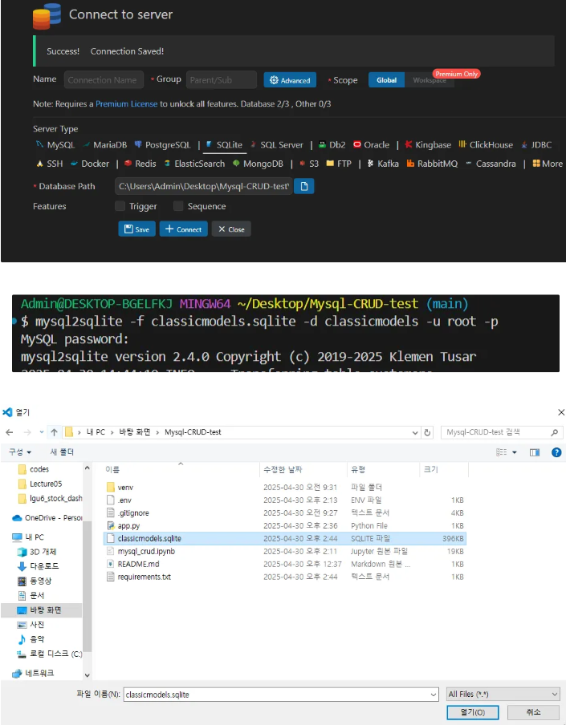
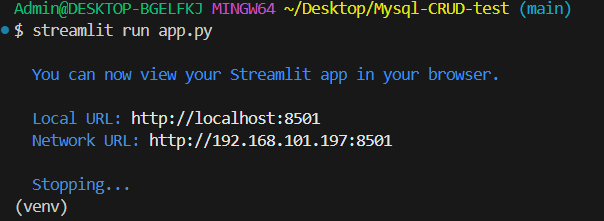
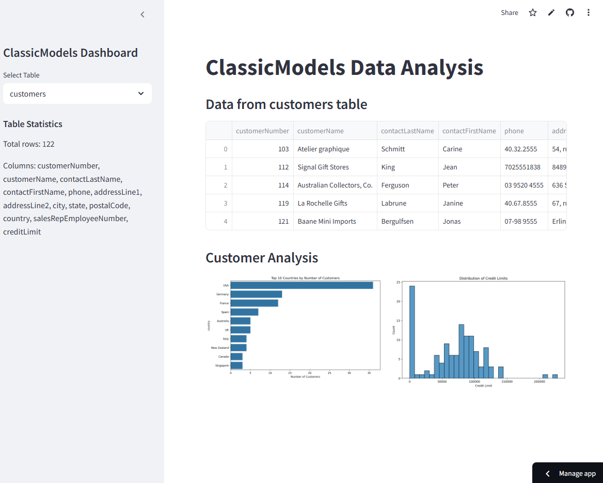

# Mysql-CRUD-test
- MySQL 데이터를 SQLite로 변환 Streamlit을 이용해서 시각화 및 배포

# ⚙️ 기술 스택
- Python
- Streamlit
- Sqlite

# 💻 Mysql to sqlite
- [사용 라이브러리](https://techouse.github.io/mysql-to-sqlite3/)

# 📊 streamlit 대시보드 개발
## 대시보드 디자인 시작
- LOCAL 에서실행

# 🚀 배포 deploy, streamlit 웹사이트

- [Streamlit 웹사이트 바로가기](https://mysql-crud-test-ed9g5snzz9vc3tcrdsldhq.streamlit.app/)

# ✅ 설치 및 실행 방법

##  Local에서 실행
- pip install -r requirements.txt
- streamlit run app.py
- http://localhost:8501 에서 확인
